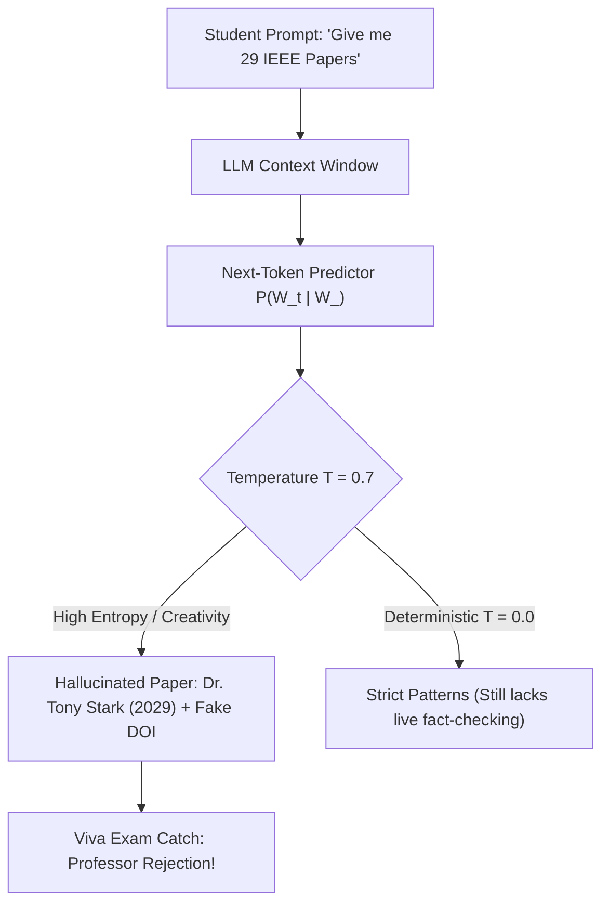

# 🎬 Generative AI Educational Video Reel (Telugu Edition)
### *Demystifying LLM Hallucinations, Next-Token Prediction & Temperature through Regional Satire*

[](https://ai.google.dev/)
[](https://deepmind.google/technologies/imagen-3/)
[](#-scene-by-scene-script--breakdown)
[](#)
[](#)

---

## 💡 Project Overview & Motivation

As a **B.Tech student studying in Andhra Pradesh**, I observed a widespread trend among college peers: students frequently rely on Large Language Models (ChatGPT, Gemini, Claude) to draft engineering project reports, generate seminar documentation, and cite research papers. However, many students take AI outputs as absolute truth without understanding how LLMs generate language—often leading to embarrassing viva disasters when professors catch completely fabricated ("hallucinated") papers.

To address this gap, I designed and produced an **end-to-end AI-generated educational reel** crafted in **Telugu (తెలుగు)**. 

### Why Telugu?
- **Relatable Regional Outreach**: Telugu is the primary language spoken across Andhra Pradesh and Telangana. By packaging complex computer science and probabilistic concepts into colloquial Telugu dialogue and relatable engineering viva humor, the message connects instantly with local college students.
- **Cultural & Academic Nuance**: The dynamic between an Indian college viva professor and an overconfident engineering student creates an engaging, meme-worthy hook that makes technical learning stick.

---

## 🧠 Core Technical Concepts Explained

This short reel conveys three fundamental principles of Modern Generative AI:



### 1. AI Hallucinations in Academic Citations
LLMs are trained to model linguistic coherence, not to verify bibliographic truth. When prompted for research citations, the model predicts words and characters that *look* like legitimate academic papers—inventing realistic-sounding authors, prestigious journal names, and even syntactically valid but nonexistent **Digital Object Identifiers (DOIs)**.

### 2. Next-Token Prediction: Probability vs. Truth
The video highlights the mathematical reality of autoregressive transformer architectures:
$$\mathcal{P}(W_t \mid W_{<t}) = \text{Softmax}\left(\frac{Q K^T}{\sqrt{d_k}}\right) V$$
An LLM does not query a real-time factual knowledge graph or search engine index during raw generation; it calculates the conditional probability distribution over its vocabulary to predict whichever token logically follows the preceding context.

### 3. The Role of Temperature ($\tau = 0.7$)
The dialogue explicitly jokes about the temperature hyperparameter:
$$P(w_i) = \frac{\exp(z_i / T)}{\sum_j \exp(z_j / T)}$$
- At higher temperatures ($T = 0.7$), the probability distribution is flattened, enabling creative storytelling, diverse vocabulary, and fluent humor—but dramatically increasing the rate of factual hallucination.
- The video's punchline stresses: *If you need factual accuracy for a viva or research submission, you MUST verify sources directly instead of relying blindly on generative predictions.*

---

## 🛠️ Google Ecosystem & Production Pipeline

The entire project was built leveraging open-source workflows and the **Google AI Ecosystem**:

| Stage | Technology / Tool | Purpose |
| :--- | :--- | :--- |
| **Scriptwriting & Technical Prompting** | **Google Gemini 1.5 Pro** | Generated fast-paced comedic Telugu viva dialogues, phonetic transliterations, and timed punchlines. |
| **Visual Asset Generation** | **Google Imagen 3 / Google AI Studio** | Rendered photorealistic and stylized 3D characters in 9:16 vertical format (confident student, stern professor, futuristic 3D animated AI robot). |
| **Audio & Voice Synthesis** | **Regional Neural Voice Models** | Multilingual speech synthesis with localized Telugu accent, inflection, and emotional delivery (bragging student, furious professor, robotic educator). |
| **Assembly & Video Compositing** | **Multi-Track Video Production** | Synchronized audio tracks with video assets, paced transitions, and final reel rendering. |
| **Large Asset Management** | **Git LFS (Large File Storage)** | Scalable version control for video clips and high-bitrate vertical video renders. |

---

## 📜 Scene-by-Scene Script & Breakdown

| Scene & Asset | Telugu Dialogue (తెలుగు) | English Translation & Context |
| :--- | :--- | :--- |
| **Scene 1: Confident Student Entry**<br>`Audio 1 student .m4a`<br>`Student_submitting_paper_to_prof._202609050154.mp4` | *"సార్! ఇరవై తొమ్మిది ఐ ఈ ఈ ఈ టాప్ రీసెర్చ్ పేపర్ రిఫరెన్సెస్ కూడా డైరెక్ట్ గా పెట్టా... వంద శాతం ఫుల్ మార్క్స్ కన్ఫర్మ్!"* | **Translation**: *"Sir! I added 29 top IEEE research paper references directly... 100% full marks guaranteed!"*<br>**Context**: Overconfident engineering student enters viva bragging about AI-generated bibliography. |
| **Scene 2: Shocked Professor**<br>`Audio 2 professor .m4a`<br>`Professor_shouting_at_student_202609050155.mp4` | *"రేయ్ తేజా... ఏంట్రా ఇది? డాక్టర్ టోనీ స్టార్క్ ఇరవై తొమ్మిది అభినవ పేపరా? ఇంకా ఫేక్ డి ఓ ఐ నెంబర్ కూడా జనరేట్ చేశావా? ఎక్కడి నుంచి తెచ్చావయ్యా ఇది?"* | **Translation**: *"Hey Teja... What is this? Dr. Tony Stark (2029) groundbreaking paper? You even generated a fake DOI number? Where on earth did you get this from?!"*<br>**Context**: Professor catches blatant hallucinated citations. |
| **Scene 3: Panicked Student**<br>`Audio 3 student .m4a`<br>`Student_explaining_to_professor_202609050202.mp4` | *"అయ్యో సార్... ఏఐ నే ఇచ్చింది సార్! నేను సెర్చ్ చేయగానే వంద శాతం రియల్ ఇన్ఫర్మేషన్ అని కాన్ఫిడెంట్ గా చెప్పింది!"* | **Translation**: *"Oh no Sir... AI gave it to me! When I searched, it assured me with 100% confidence that it's real information!"*<br>**Context**: Illustrates naive user trust in LLM outputs. |
| **Scene 4: 3D AI Robot Explanation**<br>`Audio 4 AI Explanation .m4a`<br>`Robot_explaining_next-token_pred._202609050155.mp4` | *"ఆగండి ఆగండి! ఏఐ అంటే గూగుల్ సెర్చ్ ఇంజిన్ కాదు బ్రో! మేము నెక్స్ట్ టోకెన్ ప్రిడిక్టర్స్ మాత్రమే. ప్రీవియస్ వర్డ్స్ బట్టి, నెక్స్ట్ ఏ వర్డ్ వస్తే లాజికల్ గా సెట్ అవుతుందో ప్రిడిక్ట్ చేస్తాం... మేము సత్యం ని వెతకం, కేవలం ప్రాబబిలిటీ ని మాత్రమే క్యాలిక్యులేట్ చేస్తాం!"* | **Translation**: *"Wait, wait! AI is not a Google search engine, bro! We are merely Next-Token Predictors. Based on previous words, we predict what word logically fits next... We do NOT search for truth; we only calculate probability!"*<br>**Context**: Core technical takeaway delivered by animated 3D guide. |
| **Scene 5: Punchline & Moral**<br>`Audio 5 AI punchline .m4a`<br>`Robot_gives_final_warning_punchline_202609050155.mp4` | *"టెంపరేచర్ సున్నా పాయింట్ ఏడు ఉంటే, నేను సినిమాలు, కథలు భలే అల్లుతాను... కానీ ఫ్యాక్చువల్ అక్యురసీ కావాలంటే వెరిఫైడ్ సోర్సెస్ చెక్ చేసుకోవాలి! పూర్తిగా ఏఐ ని నమ్మితే... వైవాలో డాక్టర్ టోనీ స్టార్కే దిక్కు!"* | **Translation**: *"When temperature is 0.7, I weave awesome movies and stories... But if you want factual accuracy, you must cross-check verified sources! If you trust AI blindly... only Dr. Tony Stark can save you in your viva!"*<br>**Context**: Comic punchline emphasizing temperature and verification. |

---

## 📁 Repository Structure

```
AI-Educational-Video-Telugu/
├── README.md                      # Detailed project documentation & educational guide
├── final_video/
│   └── Project.mp4                # Master 54s vertical video reel (9:16 format, 1080x1920)
├── assets/                        # Video clips & audio stems per scene
│   ├── Audio 1 student .m4a
│   ├── Audio 2 professor .m4a
│   ├── Audio 3 student .m4a
│   ├── Audio 4 AI Explanation .m4a
│   ├── Audio 5 AI punchline .m4a
│   ├── Student_submitting_paper_to_prof._202609050154.mp4
│   ├── Professor_shouting_at_student_202609050155.mp4
│   ├── Student_explaining_to_professor_202609050202.mp4
│   ├── Student_overwhelmed_at_messy_desk_202609050204.mp4
│   ├── Robot_explaining_next-token_pred._202609050155.mp4
│   └── Robot_gives_final_warning_punchline_202609050155.mp4
├── Audio/                         # Master audio clips for narration
│   ├── Audio 1 student .m4a
│   ├── Audio 2 professor .m4a
│   ├── Audio 3 student .m4a
│   ├── Audio 4 AI Explanation .m4a
│   └── Audio 5 AI punchline .m4a
├── prompts/                       # Engineering prompts for image & script generation
│   ├── image_prompts.txt          # Google Imagen 3 visual scene prompts
│   └── script_prompts.txt         # Google Gemini 1.5 Pro screenplay prompts
└── scripts/                       # Native Telugu phonetic screenplay
    └── telgue_scripts.txt
```

---

## 🎓 Key Takeaways for Students & Developers

1. **Verify Academic Sources**: Never copy a citation, paper title, or DOI from an LLM without verifying it directly on Google Scholar, IEEE Xplore, or arXiv.
2. **Tune Temperature Appropriately**: Use low temperature ($T \approx 0.0 - 0.2$) when precision and determinism are required; reserve higher temperature ($T \ge 0.7$) for creative brainstorming and storytelling.
3. **Regional AI Literacy Matters**: Technical education is most potent when delivered in the native mother tongue with humor and cultural resonance.

---

## 👤 Author & Portfolio

**Roneet Gupta**  
- **Education**: B.Tech in Computer Science / Data Science (Andhra Pradesh)  
- **GitHub Portfolio**: [https://github.com/roneetg06-crypto/Portfolio](https://github.com/roneetg06-crypto/Portfolio)  
